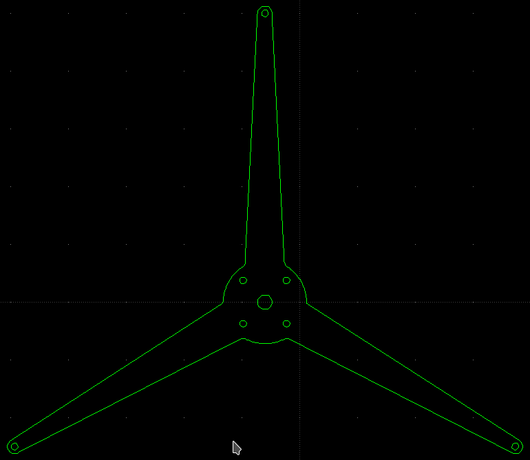
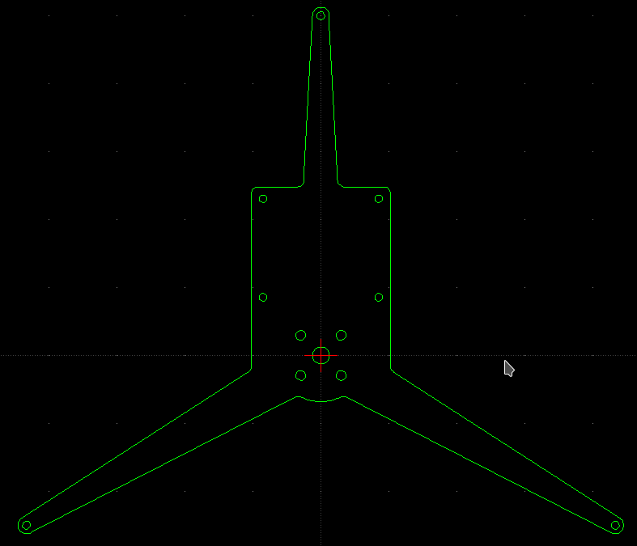

## em3245_to_littlehawk  

Parts for mounting the [EM3242 hall effect sensor
(PCB)](https://github.com/willdickson/angle_sensor_em3242) and the
[teensy_to_em3242 shield](https://github.com/willdickson/teensy_to_em3242) on
the little hawk wind vane.

### Top Plate

### Bottom Plate

